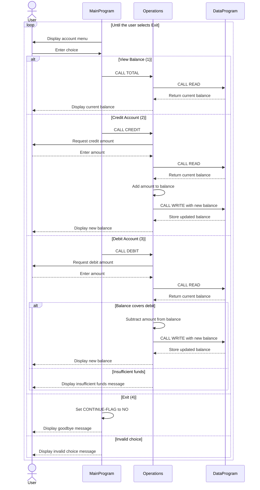

# COBOL Account Management Documentation

This directory documents the COBOL account-management example in `src/cobol`. The program models a simple student account with a starting balance, credits, debits, and balance inquiries.

## COBOL Files

### `data.cob`

Defines `DataProgram`, the storage component for the account balance.

Key functions:

- Initializes the stored balance to `1000.00`.
- Handles the `READ` operation by copying the stored balance to the caller's balance field.
- Handles the `WRITE` operation by replacing the stored balance with the caller's balance.
- Accepts six-character operation codes through the linkage section.

The balance is held in working storage, so it is available only for the lifetime of the running program and is not written to an external file or database.

### `operations.cob`

Defines `Operations`, the business-logic component. It receives an operation code from the main program and coordinates balance reads and writes through `DataProgram`.

Key functions:

- `TOTAL `: Reads and displays the current balance.
- `CREDIT`: Prompts for an amount, adds it to the current balance, saves the result, and displays the new balance.
- `DEBIT `: Prompts for an amount, checks that sufficient funds are available, subtracts it when allowed, saves the result, and displays the new balance.

The trailing spaces in `TOTAL ` and `DEBIT ` are significant because the operation type is defined as `PIC X(6)`.

### `main.cob`

Defines `MainProgram`, the interactive entry point for the application.

Key functions:

- Displays the account-management menu.
- Accepts a user choice from 1 through 4.
- Calls `Operations` for balance inquiries, credits, and debits.
- Repeats the menu until the user selects Exit.
- Displays an error for choices outside the supported range.

## Student Account Business Rules

- Every account starts with a balance of `1000.00` when the program initializes.
- A balance inquiry does not change the account balance.
- A credit increases the balance by the amount entered.
- A debit is allowed only when the current balance is greater than or equal to the requested amount.
- A debit that exceeds the current balance is rejected and displays `Insufficient funds for this debit.`; the balance is unchanged.
- Successful credits and debits are written back through `DataProgram` before the new balance is displayed.
- The source does not define validation for negative amounts, zero amounts, or non-numeric input. It also does not persist balances after the program exits.

## Program Flow

```text
MainProgram
    -> Operations (TOTAL / CREDIT / DEBIT)
        -> DataProgram (READ)
        -> DataProgram (WRITE, for successful CREDIT or DEBIT)
```

The user exits through menu option 4. The program then displays a goodbye message and stops.

## Application Sequence Diagram


